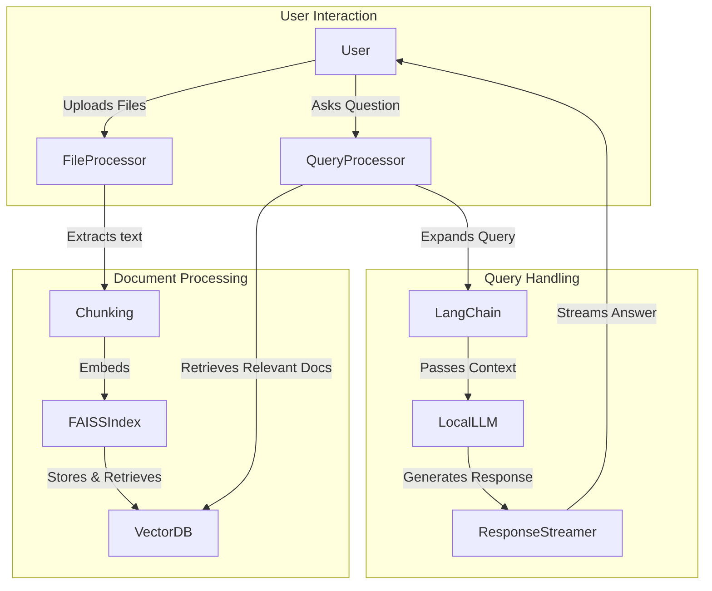

# 🚀 RAG-Backend: Local LLM-Powered Retrieval-Augmented Generation System


---

## 🏆 Introduction: What is RAG-Backend?
**RAG-Backend** is a powerful **open-source, local LLM-powered Retrieval-Augmented Generation (RAG) system** designed for **intelligent document-based answering**. It allows users to **upload multiple file types** (PDFs, DOCX, Excel, XML, etc.), **index them into a vector database**, and **perform intelligent searches** to get **accurate and context-aware responses**.  

### 🎯 Key Highlights:
- **Works Offline** – No internet dependency, **privacy-first** approach.
- **Multi-format Support** – Handles **PDFs, Word Docs, Excel, XML, etc.**
- **Hybrid Search Mechanism** – Combines **vector-based retrieval (FAISS)** + **keyword-based retrieval (BM25)**.
- **Local AI Chatbot** – Uses **Llama2, Mistral-7B, TinyLlama** via `llama.cpp` for **smart, real-time answers**.
- **Optimized for Speed & Accuracy** – Uses **LangChain** for **query expansion & efficient search ranking**.

---

## 🤔 What is RAG? (Retrieval-Augmented Generation)
Imagine you're a **student preparing for exams**.  
You have tons of PDFs, notes, research papers, and books on your laptop.  
You want to **quickly find answers** instead of searching manually.  

**Traditional Search:**  
🔍 Searching for "**Newton’s Third Law**" in your PDFs **only finds matching keywords** but **doesn’t explain** the concept.  

**With RAG:**  
✅ You **ask your AI assistant**: *"Explain Newton's Third Law in simple terms with examples."*  
✅ The AI **retrieves the most relevant documents** related to Newton’s Laws.  
✅ The AI **understands** the content and **generates a summarized answer** in **simple language**.  
✅ The AI can **cite the exact sources** where the information came from.  

🔹 **Result:** You get an **accurate, AI-generated explanation** **without manually reading all documents!**  

### 🛠 How RAG Works (Technical Breakdown)
**Retrieval-Augmented Generation (RAG)** combines **two steps**:

1️⃣ **Retrieval Phase**:  
   - The system **scans the uploaded documents** and **finds the most relevant content** based on the user’s query.  
   - Uses **FAISS** (dense vector retrieval) for **semantic similarity search**.  
   - Uses **BM25** (sparse retrieval) for **keyword-based matching**.  
   - Uses **LangChain** to **expand queries & rank results efficiently**.  

2️⃣ **Generation Phase**:  
   - The **retrieved content is passed** to a **local LLM (e.g., Llama2, Mistral-7B)**.  
   - The model **understands the context** and **generates a well-structured response**.  
   - The answer is **streamed in real-time** so the user gets an instant reply.  

---

## 🏗 **RAG-Backend System Architecture**

---

## To use, download the below LLMs and tryout by updating the config giving the Local LLM Path
### Larger Models

#### Llama 2 GGUF
```
wget -P models https://huggingface.co/TheBloke/Llama-2-7B-GGUF/resolve/main/llama-2-7b.Q4_K_M.gguf
```

#### Mistral 7B GGUF
```
wget -P https://huggingface.co/TheBloke/Mistral-7B-Instruct-v0.1-GGUF/resolve/main/mistral-7b-instruct-v0.1.Q4_K_M.gguf
```

### Smaller Models
#### TinyLlama 1.1B (FASTEST)
```
wget -P https://huggingface.co/TheBloke/TinyLlama-1.1B-Chat-v0.3-GGUF/resolve/main/tinyllama-1.1b-chat-v0.3.Q4_K_M.gguf
```

#### Mistral 7B (Quantized)
```
wget -P https://huggingface.co/TheBloke/Mistral-7B-Instruct-v0.1-GGUF/resolve/main/mistral-7b-instruct-v0.1.Q4_K_M.gguf
```

#### Llama 2 7B (Quantized)
```
wget -P https://huggingface.co/TheBloke/Llama-2-7B-GGUF/resolve/main/llama-2-7b.Q4_K_M.gguf
```

---

## 🔥 Key Features

### ✅ 1. Multi-format Document Processing
- Parses and indexes **PDFs, DOCX, Excel, XML, Text**.
- Uses **OCR (Tesseract)** for images and **XML parsers** for structured files.

### ✅ 2. Hybrid Search
- **FAISS-based vector search** for **semantic matching**.
- **BM25 keyword-based search** for **keyword matching**.

### ✅ 3. Local LLM Integration
- Works with **TinyLlama, Llama2, Mistral-7B** models via `llama.cpp`.

### ✅ 4. Streaming AI Chat (WebSockets)
- **No delays** – responses are **streamed token-by-token** in real-time.

### ✅ 5. Efficient Query Expansion (LangChain)
- Enhances queries using **synonym-based expansion**.
- Improves **retrieval accuracy** via **reranking & hybrid search**.

---

## 🛠 Tech Stack

### **Programming Language:**
🟢 **Python 3.10++**

### **Key Libraries & Frameworks:**
- 🏗 **LangChain** – RAG and Query Optimization
- 📖 **FAISS** – Dense Vector Search
- 🏆 **BM25** – Sparse Text Search
- 🖼 **Tesseract OCR** – Image Text Extraction
- 🧠 **Llama.cpp** – Local LLM Inference
- 🖋 **Sentence Transformers** – Hugging Face Embeddings

---

## 🚀 Installation & Setup

### 1️⃣ Clone the Repository
```bash
git clone https://github.com/your-username/rag-backend.git
cd rag-backend

### 2️⃣ Create a Virtual Environment
```bash
Copy
Edit
python -m venv venv
source venv/bin/activate   # On macOS/Linux
venv\Scripts\activate      # On Windows
```

### 3️⃣ Install Dependencies
```bash
Copy
Edit
pip install -r requirements.txt
```

####  Download the LLM (see above for links) and copy to /models

### 4️⃣ Start the Backend
```bash
Copy
Edit
python main.py
```

### 5️⃣ Access the Web Interface
Open http://localhost:8000 in your browser.

####  Go to config and update the Local LLM path
---

## 🎯 Future Enhancements
- ✅ Support for Audio & Video Transcription (e.g., Whisper AI)
- ✅ Fine-tuned LLMs for better contextual responses
- ✅ Support for additional vector databases (Chroma, Pinecone, Weaviate)
- ✅ Parallel processing for large-scale document indexing

---
